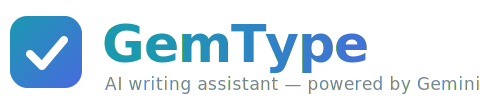

<div align="center">



**Grammarly-style writing assistant for every website — powered by your own free Gemini API key.**

[](#install)
[](extension/manifest.json)
[](extension/manifest.json)
[](LICENSE)
[](../../pulls)



</div>

---

## Features

- **Live grammar and spelling checking** — underlines appear in any text field about a second after you stop typing: Gmail, LinkedIn, X, Reddit, GitHub, anywhere
- **One-click fixes** — click an underline and accept the correction; `Ctrl/Cmd+Z` always undoes
- **Sentence verification** — after every accepted fix, the surrounding sentence is automatically re-checked, so word-level fixes never leave broken sentences behind
- **Rewrite on demand** — select text for a floating toolbar with *Improve, Fix, Shorten, Formal,* and *Casual* actions, also available from the right-click menu
- **Context-aware suggestions** — an LLM judges whole sentences in any language, not just pattern rules
- **Bring your own key** — uses your free [Google AI Studio](https://aistudio.google.com/apikey) key; no account, no subscription, no middleman server
- **Private by design** — text goes only to Google's Gemini API; no tracking, no analytics, nothing else phones home
- **Full control** — per-site disable, global toggle, model picker, language setting; honors `data-gramm="false"` opt-outs

## Comparison with Grammarly

| | GemType | Grammarly |
|---|---|---|
| Price | Free — bring your own Gemini key ([free tier](https://aistudio.google.com/apikey), no card required) | Free plan is limited; Premium $12–30 per month |
| Grammar and spelling fixes | Unlimited | Full corrections require Premium |
| Sentence re-check after each accepted fix | Automatic | Not available |
| AI rewrites (Improve, Shorten) | Included | Premium |
| Preset styles (Formal, Casual) | Included | Premium |
| Languages | Any language Gemini understands, auto-detected | English and a small set of variants |
| Trackers and analytics | None | Product analytics and telemetry |
| Account required | No | Yes |
| Where your text is processed | Google's Gemini API only, with your key — no middleman server | Grammarly's servers |
| Open source | Yes (MIT) | No |
| Google Docs | Not supported (Google whitelists specific vendors) | Supported |

**What does "bring your own key" really cost?** For a single person typing,
the free Gemini tier is more than enough — GemType checks only after you
pause, skips unchanged text, and caches results, so even a heavy writing day
stays comfortably inside the free quota. On the paid tier, a typical check
costs around $0.0003 — roughly one dollar per month for very heavy daily
use, compared with $144–360 per year for Premium.

## Install

**Chrome Web Store** — *coming soon.*

**Manual (developer mode):**

1. Download or clone this repository
2. Open `chrome://extensions` and enable **Developer mode**
3. Click **Load unpacked** and select the `extension/` folder
4. Get a free API key at [aistudio.google.com/apikey](https://aistudio.google.com/apikey) (no credit card required)
5. Open GemType **Settings** from the toolbar icon, paste the key, and click **Save & test**

**Safari** — the same code base wraps into a Safari App Extension; see [Safari build](#safari) below.

## How it works

```
             page (any website)
┌──────────────────────────────────────────┐
│  content script                          │
│  ├─ detects textarea / contenteditable   │
│  ├─ draws underline overlay (shadow DOM, │
│  │   never touches the page's editor)    │
│  └─ applies fixes via execCommand        │
│      (native undo + framework-safe)      │
└──────────────┬───────────────────────────┘
               │ chrome.runtime messaging
┌──────────────▼───────────────────────────┐
│  background service worker               │
│  ├─ queue + cache + 429 backoff          │
│  └─ Gemini generateContent               │
│      (structured JSON output)            │
└──────────────┬───────────────────────────┘
               ▼
   generativelanguage.googleapis.com
        (your API key, your data)
```

- **Overlay, not injection** — underline positions come from `Range.getClientRects()` (rich editors) or a mirror element (plain fields); the page's DOM is never modified, so React, Vue, and ProseMirror editors stay stable
- **Snippet anchoring** — the model returns exact text snippets, located client-side and re-anchored live as you type (LLM character offsets are unreliable)
- **Token-frugal** — debounced checks, unchanged-text skipping, response caching, and sentence-scoped re-checks keep free-tier quota comfortable for daily use

## Site support

| Editor type | Status |
|---|---|
| Plain `textarea` / `input` (GitHub, forums, most forms) | Supported |
| `contenteditable` rich editors (Gmail, LinkedIn, X) | Supported |
| Shadow-DOM web components (Reddit) | Supported |
| Google Docs (canvas rendering; requires a Google-whitelisted extension ID) | Not supported — use the right-click rewrite instead |

## Privacy

- The text you are editing is sent **only** to `generativelanguage.googleapis.com` (Google's Gemini API) using your own key — see [PRIVACY.md](PRIVACY.md)
- Your API key lives in `chrome.storage.local` on your device; it is never synced or transmitted anywhere else
- Password fields are never read, and payment or one-time-code fields are skipped at the code level
- No accounts, no telemetry, no third-party servers
- Sites can opt out with `data-gemtype="false"`; Grammarly-style opt-outs are honored as well

## Project structure

```
extension/              the Chrome extension (MV3, no build step)
├── manifest.json
└── src/
    ├── background.js       Gemini API calls, cache, rate limiting
    ├── content/
    │   ├── content.js      field discovery + checking loop
    │   ├── overlay.js      underlines, badge, suggestion card
    │   ├── refine.js       selection rewrite toolbar
    │   └── util.js         text extraction, offset maps, safe replacement
    ├── options.html/js     API key, model, language, disabled sites
    └── popup.html/js       global + per-site toggles
test/
├── test-page.html      manual test fields (incl. scroll + opt-out cases)
└── harness.html        automated harness with a mocked Gemini backend
store/                  Chrome Web Store listing assets
safari/                 Xcode wrapper project (generated)
```

## Development

```bash
# run the mock harness (no API key needed)
python3 -m http.server 8377
open http://localhost:8377/test/harness.html
```

<a name="safari"></a>**Safari build** (requires Xcode):

```bash
xcrun safari-web-extension-converter extension --project-location safari --app-name GemType --macos-only
xcodebuild -project safari/GemType/GemType.xcodeproj -scheme GemType -configuration Debug build
```

Then in Safari: Settings → Developer → **Allow unsigned extensions** → enable GemType.

## Roadmap

- [ ] Chrome Web Store release
- [ ] Hosted key option (proxy backend) — zero setup for end users
- [ ] Tone and style preferences per site
- [ ] Firefox port
- [ ] iOS / Android keyboards sharing the same backend

## Responsible use

GemType sends the text you are actively editing to Google's Gemini API for
analysis. Do not use it in fields containing passwords, secrets, or text you
are not comfortable processing with a cloud AI service — or disable it for
those sites with one click.

## License

[MIT](LICENSE) © 2026 Matily
